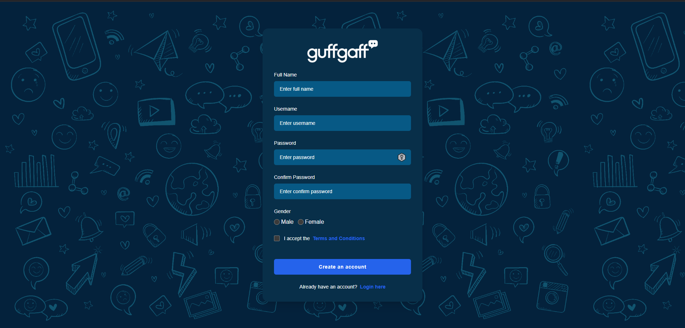

## GuffGaff - Connect with friends
A real-time chat application built using the MERN stack (MongoDB, Express, React, and Node.js). It supports real-time messaging, user authentication, active status and has a pleasing simple user interface.


## ScreenShots
### Desktop



### Mobile


## Demo

https://guffgaff-kpsd.onrender.com  
This is the link to deployed website. You can check it out.  
<span style="color:red">First time opening website may take some time approximately 1 minute</span>


## Features

- Real-time messaging with WebSocket (using Socket.io)
- User authentication (sign up, login, and logout)
- Chat history with MongoDB storage
- Responsive design for desktop and mobile
- Attractive toast info

## Tech Stack
- **Frontend**: React, Zustand, TailwindCSS, DaisyUI
- **Backend**: Node.js, Express, Mongoose
- **Database**: MongoDB
- **Real-time Communication**: Socket.io
- **Authentication**: JWT (JSON Web Token) for session handling


## Prerequisites
If you want to try this web service locally, these are the prerequisite
- Node.js installed (version 14 or above)
- MongoDB installed or a MongoDB Atlas account for cloud hosting and connection string
## Folder Structure

```bash 
GuffGaff
    ├──backend
    ├──frontend
    ├──.env
    ├──.gitignore
    ├──package-lock.json
    ├──package.json
    └──README.md
```
## Installation

Clone this github repo in a folder by running this command in this folder

```bash
 git clone https://github.com/Prabin1025y/GuffGaff
```

Open repo folder in terminal
```bash
 cd GuffGaff
```

Create a .env file in GuffGaff directory add following variables  
```bash
PORT = 8000
MONGO_DB_URL = Your Mongodb Connection String
JWT_SECRET = Your JWT Sectret (can be literally anything like your name)
NODE_ENV = development
```

Run the build command
```bash
 npm run build
```

Run the start command
```bash
 npm run start
```

The website will start in http://localhost:8000 or in PORT of your environment

## Contributing

Contributions are welcome! Please fork the repository, create a new branch, and submit a pull request.


## License

This project is licensed under the MIT License.


## Contact
- GitHub: [Prabin1025y](https://github.com/Prabin1025y)
- LinkedIn: [Prabin Acharya](https://www.linkedin.com/in/prabin-acharya-9345b32b5/)
- Email: acharyaprabin1025y@gmail.com